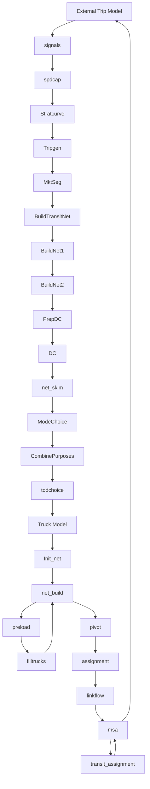

```mermaid
graph TD;
External_Trip_Model[External Trip Model];
signals[signals];
spdcap[spdcap];
Stratcurve[Stratcurve];
Tripgen[Tripgen];
MktSeg[MktSeg];
BuildTransitNet[BuildTransitNet];
BuildNet1[BuildNet1];
BuildNet2[BuildNet2];
PrepDC[PrepDC];
DC[DC];
net_skim[net_skim];
ModeChoice[ModeChoice];
CombinePurposes[CombinePurposes];
todchoice[todchoice];
Truck_Model[Truck Model];
Init_net[Init_net];
net_build[net_build];
preload[preload];
filltrucks[filltrucks];
net_build[net_build];
pivot[pivot];
assignment[assignment];
linkflow[linkflow];
msa[msa];
transit_assignment[transit_assignment];
msa[msa];
External_Trip_Model[External Trip Model];
External_Trip_Model-->signals-->spdcap-->Stratcurve-->Tripgen-->MktSeg-->BuildTransitNet-->BuildNet1-->BuildNet2-->PrepDC-->DC-->net_skim-->ModeChoice-->CombinePurposes-->todchoice-->Truck_Model-->Init_net-->net_build-->preload-->filltrucks-->net_build-->pivot-->assignment-->linkflow-->msa-->transit_assignment-->msa-->External_Trip_Model;
```
